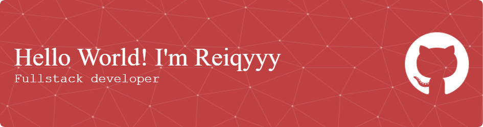

## Hello World I'm Reiqyyy 👋

<!--
**Reiqyyy/Reiqyyy** is a ✨ _special_ ✨ repository because its `README.md` (this file) appears on your GitHub profile.

Here are some ideas to get you started:

- 🔭 I’m currently working on ...
- 🌱 I’m currently learning ...
- 👯 I’m looking to collaborate on ...
- 🤔 I’m looking for help with ...
- 💬 Ask me about ...
- 📫 How to reach me: ...
- 😄 Pronouns: ...
- ⚡ Fun fact: ...
-->

- 👋 Hello I'm Reiqyy You can call me Reiqyy or Bayu because that's is my real name Thank you so much
- 🌱 I’m currently learning html, Css, and Java
- 👯 I’m looking to collaborate on Web Developer
- 📑 My Favorite Laguage Program it's Java Script

### 💻 Favourite Languages
yo, here are my favourite languages (from left to right):

  
  
  
  
  
  
  
  

---

### 📫 Contact Me
- Instagram: [@reiqyy02](https://instagram.com/reiqyy02)
- Discord: Reiqyyy#xxxx

